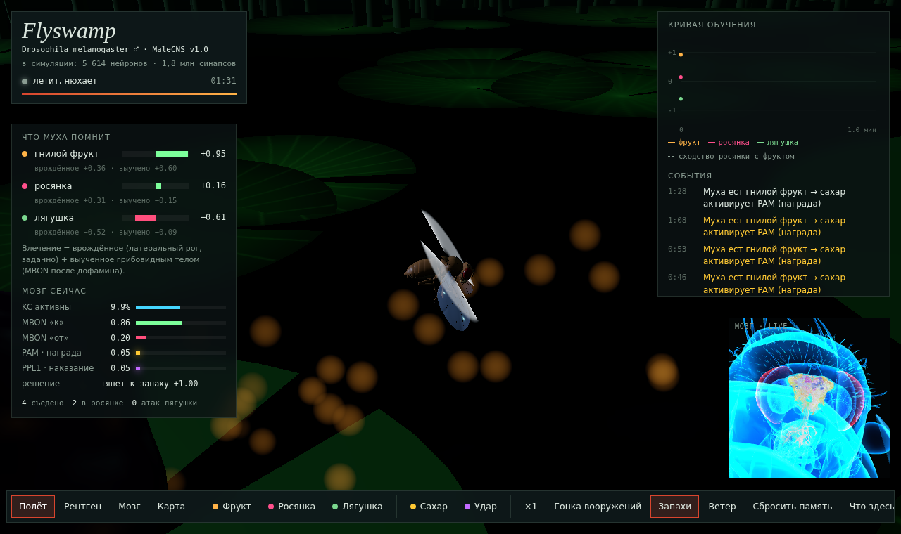
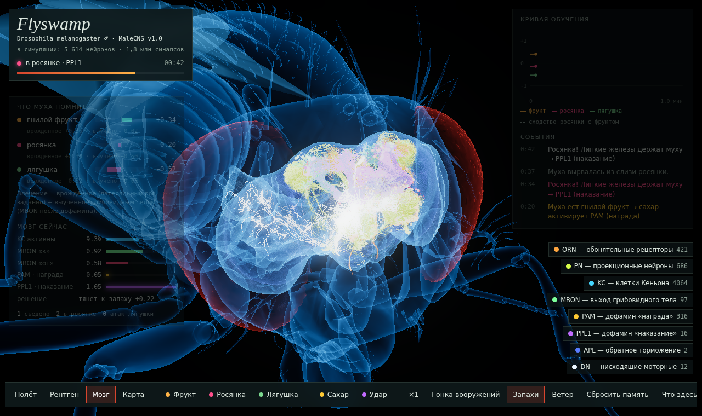

# Flyswamp

Плодовая мушка с настоящей проводкой мозга живёт на ночном болоте. Она ищет по запаху гнилые фрукты и учится не садиться на росянку, которая пахнет почти как еда. Обучение идёт через реальный грибовидный мозг (mushroom body) из коннектома **MaleCNS v1.0**: дофамин меняет синапсы KC→MBON. В режиме «рентген» видно, какие нейроны сейчас работают: 5 614 реальных нейронов с настоящей анатомией внутри головы и груди мухи.

О проекте целиком (зачем, данные, инструменты, что наше): [docs/PROJECT.md](docs/PROJECT.md). Научный реестр с проверками: [docs/SCIENCE.md](docs/SCIENCE.md). План по фазам: [docs/ROADMAP.md](docs/ROADMAP.md).




## Запуск

```bash
cd web
npm install
npm run dev        # http://localhost:5173
npm test           # 13 тестов: спайковый движок, цепь, обучение, контроли, мир
npm run build      # статическая сборка в web/dist
```

Данные уже лежат в `web/public/data` (около 14 МБ), бэкенд не нужен: всё считается в браузере.

Управление:

| что | как |
|---|---|
| камера | `1` полёт · `2` рентген · `3` мозг · `4` карта, мышь вращает и приближает |
| поставить объект | «Фрукт» / «Росянка» / «Лягушка», затем клик по воде |
| учить руками | «Сахар» включает PAM (награду), «Удар» включает PPL1 (наказание): муха запомнит запах, который нюхает в этот момент |
| гонка вооружений | росянки каждые 12 с подбирают мутации своего запаха под текущую память мухи |
| нейроны | в рентгене и мозге легенда справа включает и выключает группы, наведение на сому показывает тип, bodyId и активность |

## Что происходит

```
 запах (гломерулы) ─► ORN→PN (реальные синапсы, нормализация Olsen 2010)
                      PN→KC (20 777 связей) ─► 4 064 KC, разреженный код ~7–12 %, APL тормозит обратно
                      KC→MBON (51 085 связей × пластичный коэффициент) ─► 97 MBON ─► «к запаху / от запаха»
 еда (сахар)  ─► PAM  ┐  DAN→MBON-проводка выбирает компартмент,
 росянка/лягушка ─► PPL1 ┘  где подавляются синапсы недавно активных KC (след ~2 с)
```

1. Муха нюхает смесь шлейфов в точке головы. Шлейфы — аналитическая модель: гауссов шлейф по ветру с мерцанием.
2. Мозг выдаёт валентность, то есть сдвиг баланса MBON «к» и «от» относительно наивной цепи. До обучения она строго 0.
3. Итоговое влечение = врождённое (DM1 и VA2 тянут к уксусу/брожению, DA2 и V отталкивают: геосмин и CO₂) + выученное.
4. Руление: поворот к более сильной антенне и против ветра, если влечёт; от запаха и по ветру, если отталкивает. Без запаха муха ищет случайным блужданием.
5. Муха садится, если влечение выше порога (порог ниже, когда она голодна):
   - на фрукте она ест, сахар включает PAM, и влечение к этому запаху растёт;
   - на росянке она застревает, включается PPL1, и запах начинает отталкивать.
6. Лягушка бьёт языком. Гигантское волокно DNp01 уносит муху, и срабатывает наказание.

Запах росянки перекрывается с фруктовым: у них общие DM1 и VA2, поэтому наивная муха охотно садится на росянку. Различать их она учится за счёт KC, которые активны только от одного из запахов.

## Результаты (headless, `node scripts/experiment.mjs 15 4`)

4 сида × 15 минут симулированного времени на условие. Частоты в минуту по окнам 0–2, 2–5, 5–10, 10–15 мин.

| условие | попаданий в росянку / мин | фруктов съедено / мин | итоговое влечение: фрукт / росянка / лягушка |
|---|---|---|---|
| целая цепь | 1.25 → 0.92 → 1.05 → 1.15 | 1.88 → 3.50 → 3.15 → 2.45 | +0.46 / −0.36 / −0.62 |
| без дофамина | 2.13 → 2.00 → 2.30 → 1.90 | 2.25 → 3.08 → 2.20 → 2.15 | +0.36 / +0.31 / −0.52 |
| без APL | 1.25 → 0.92 → 1.00 → 1.00 | 2.25 → 3.58 → 2.90 → 2.50 | +0.22 / −0.42 / −0.53 |
| перемешанная проводка PN→KC | 1.13 → 0.75 → 0.95 → 1.10 | 2.63 → 3.17 → 3.00 → 2.40 | +0.57 / −0.20 / −0.78 |

Как читать: с дофамином муха попадает в росянку примерно вдвое реже, чем без него, и ест не меньше. Обучение быстрое: разница видна уже в первые 2 минуты. Дальше частота держится около 1 в минуту, потому что память постепенно забывается, голод повышает риск, а запахи росянки и фрукта частично обобщаются. Контроли честно показывают другое: без APL и с перемешанной проводкой PN→KC муха избегает росянку почти так же хорошо. В этой задаче запахи достаточно разные, и тонкости проводки на поведение почти не влияют. Разница видна в памяти: без APL слабее выученная привязанность к фрукту, с перемешанной проводкой слабее отвращение к росянке. Это прототип, не биологическая валидация.

### Гонка вооружений (`node scripts/experiment.mjs 10 3 --arms`)

Росянки каждые 12 с перебирают мутации своего запаха и оставляют ту, что сильнее тянет эту муху: её текущая память проверяется на копии мозга без побочных эффектов. 3 сида × 10 минут, окна 0–2, 2–5, 5–10 мин:

| условие | попаданий в росянку / мин | итоговое влечение: фрукт / росянка |
|---|---|---|
| целая цепь | 1.17 → 2.00 → 1.80 | +0.36 / +0.21 |
| без дофамина | 1.50 → 2.44 → 2.33 | +0.36 / +0.42 |
| без APL | 1.00 → 1.22 → 1.53 | +0.05 / −0.10 |
| перемешанная проводка PN→KC | 1.17 → 2.00 → 1.93 | +0.44 / +0.11 |

Росянки выигрывают. Через пару минут частота ловушек у обучающейся мухи удваивается, а росянка снова становится привлекательной: мимикрия подстраивается быстрее, чем муха переучивается. Лучше всех держится муха без APL, но она почти ничего не помнит и про фрукт (+0.05). Её устойчивость похожа на общую осторожность, а не на различение. Почему так, я не проверял.

## Что здесь настоящее, а что модель

**Настоящее:**
- Проводка из MaleCNS v1.0: ORN (по гломерулам), 686 PN, 4 064 KC, 97 MBON, 316 PAM, 16 PPL1, 2 APL. Веса — число синапсов. Пороги шума описаны в `pipeline/build_circuit.py`.
- Знак MBON выведен из проводки. MBON в компартментах PAM → «от», в компартментах PPL1 → «к» (правило Aso et al. 2014, eLife). Результат совпадает с литературой: MBON01–05 на избегание, MBON11–14 на приближение.
- Анатомия. Скелеты всех 5 614 нейронов цепи, 141 781 сома всего CNS, оболочки мозга и VNC, 19 нейропилей, 116 гломерул и 30 компартментов MB — реальная геометрия. CNS вставлен в тело одной жёсткой трансформацией в натуральном масштабе (мм).
- Тело: анатомическая модель flybody (TuragaLab) с 102 шарнирами.

**Модель и допущения:**
- Rate-модель, а не LIF. Вспышки спайков на экране семплируются из частот и служат только визуализацией.
- Запахи — стилизованные паттерны по реальным гломерулам. Реальных данных рецепторов (DoOR) нет.
- Пластичность — только депрессия KC→MBON с медленным восстановлением. MBON→MBON и MBON→DAN не участвуют.
- Врождённое влечение (латеральный рог) задано формулой, а не проводкой.
- Голод ослабляет выражение аверсивной памяти. Это дизайн-решение, чтобы голодная муха рисковала.
- Моторные DN (DNa01/02, DNp01, DNp09, MDN) подсвечиваются контроллером поведения, а не считаются по коннектому.
- Взмах крыльев, походка и хоботок — процедурная анимация, физики тела нет.

## Структура

```
pipeline/            Python: данные → web/public/data
  build_circuit.py   цепь из MaleCNS (feather-таблицы из gs://flyem-male-cns)
  build_fly.py       flybody (MJCF через mujoco) → fly.glb + суставы
  build_anatomy.py   ROI-объёмы → меши, SWC-скелеты → neurons.bin, сомы → somas.bin
  build_graph.py     граф всего CNS MaleCNS для спайкового движка (.cache/graphs)
web/src/sim/         модель: lif.js + graph.js (спайковый движок), brain.js (MB), world.js (болото), odors.js, activity.js
web/src/render/      three.js: fly, brain (рентген), swamp, props, plumes, cameras
web/src/ui/          HUD
web/test/            node --test
scripts/             experiment.mjs (headless-эксперименты), shot.mjs (скриншоты), artifact.mjs, setup.sh (эталоны, данные, графы)
validation/          сверка движка с эталоном Shiu et al. 2024 и бенчмарки на MaleCNS
docs/                PROJECT.md, SCIENCE.md, ROADMAP.md
web/dev/             стенды: риг мухи и рентген отдельно
```

Пересобрать данные с нуля (скачает около 1,5 ГБ в `.cache/`):

```bash
pip install -r pipeline/requirements.txt
cd pipeline
python build_circuit.py && python build_fly.py && python build_anatomy.py
```

## Атрибуция

- **MaleCNS v1.0** — FlyEM (HHMI Janelia), University of Cambridge (Dept. of Zoology), MRC Laboratory of Molecular Biology, Google Research. Лицензия CC-BY 4.0. Как цитировать: https://male-cns.janelia.org/. Извлечённый подграф в `web/public/data` распространяется на тех же условиях.
- **flybody** — TuragaLab, Apache-2.0, https://github.com/TuragaLab/flybody.
- Литература, на которую опираются допущения:
  - Aso et al. 2014, eLife — валентность MBON;
  - Olsen, Bhandawat & Wilson 2010, Neuron — нормализация PN;
  - Semmelhack & Wang 2009, Nature — DM1/VA2 и влечение;
  - Stensmyr et al. 2012, Cell — DA2 и геосмин;
  - Suh et al. 2004, Nature — CO₂;
  - Ai et al. 2010, Nature — DP1m и кислоты.
